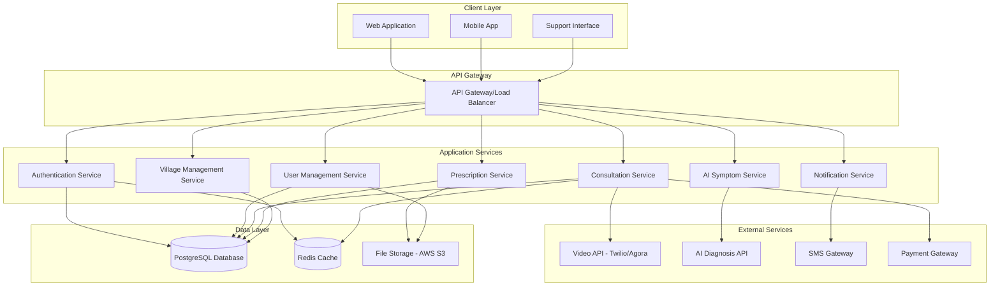
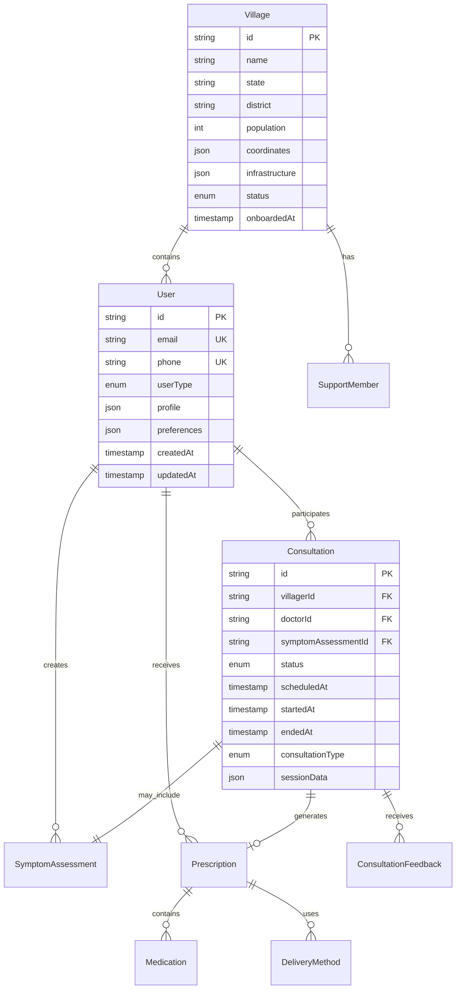

# Design Document: Digital Health Bridge

## Overview

Digital Health Bridge is a comprehensive telemedicine platform designed to connect rural villagers in India with newly graduated doctors through AI-powered preliminary diagnosis and real-time consultations. The platform addresses critical healthcare access gaps by combining modern technology with local support systems to overcome literacy and connectivity barriers.

The system architecture follows a microservices approach with a React-based frontend, Node.js/Express backend, and integration with third-party APIs for video calling and AI diagnosis. The platform is designed to be mobile-first, offline-capable where possible, and optimized for low-bandwidth environments common in rural India.

## Architecture

### High-Level Architecture



### Technology Stack

**Frontend:**
- React 18 with TypeScript for type safety
- Material-UI for consistent, accessible design
- Progressive Web App (PWA) capabilities for offline functionality
- WebRTC integration for video calling
- Multi-language support with react-i18next

**Backend:**
- Node.js with Express.js framework
- TypeScript for type safety and better maintainability
- JWT-based authentication with refresh tokens
- RESTful API design with OpenAPI documentation
- WebSocket support for real-time features

**Database:**
- PostgreSQL for primary data storage with ACID compliance
- Redis for session management and caching
- AWS S3 for file storage (prescriptions, documents)

**External Integrations:**
- Twilio Video API for telemedicine consultations
- ApiMedic or EndlessMedical API for AI symptom checking
- Twilio SMS for notifications and prescription delivery
- Razorpay for payment processing

## Components and Interfaces

### User Management Component

**Purpose:** Handles registration, authentication, and profile management for all user types.

**Key Interfaces:**
```typescript
interface User {
  id: string;
  email: string;
  phone: string;
  userType: 'villager' | 'doctor' | 'admin' | 'support';
  profile: UserProfile;
  preferences: UserPreferences;
  createdAt: Date;
  updatedAt: Date;
}

interface DoctorProfile extends UserProfile {
  medicalLicense: string;
  specialization: string[];
  experience: number;
  availability: AvailabilitySchedule;
  verificationStatus: 'pending' | 'verified' | 'rejected';
  rating: number;
  consultationCount: number;
}

interface VillagerProfile extends UserProfile {
  village: string;
  emergencyContact: string;
  medicalHistory: MedicalRecord[];
  preferredLanguage: string;
}
```

**Core Functions:**
- User registration with role-based validation
- Medical license verification for doctors
- Multi-factor authentication for security
- Profile management with medical history tracking

### AI Symptom Checker Component

**Purpose:** Provides preliminary medical assessment and triage using external AI APIs.

**Key Interfaces:**
```typescript
interface SymptomAssessment {
  id: string;
  userId: string;
  symptoms: Symptom[];
  assessment: PreliminaryDiagnosis;
  urgencyLevel: 'low' | 'medium' | 'high' | 'emergency';
  recommendations: string[];
  createdAt: Date;
}

interface Symptom {
  name: string;
  severity: number; // 1-10 scale
  duration: string;
  description: string;
}

interface PreliminaryDiagnosis {
  possibleConditions: Condition[];
  confidence: number;
  requiresImmediateAttention: boolean;
  suggestedSpecialist: string;
}
```

**Core Functions:**
- Natural language symptom processing
- Integration with medical AI APIs (ApiMedic/EndlessMedical)
- Urgency classification and triage
- Recommendation generation for next steps

### Consultation Management Component

**Purpose:** Orchestrates the entire consultation process from booking to completion.

**Key Interfaces:**
```typescript
interface Consultation {
  id: string;
  villagerId: string;
  doctorId: string;
  symptomAssessmentId?: string;
  status: ConsultationStatus;
  scheduledAt: Date;
  startedAt?: Date;
  endedAt?: Date;
  consultationType: 'video' | 'audio' | 'chat';
  sessionData: SessionData;
  prescription?: Prescription;
  feedback: ConsultationFeedback;
}

interface SessionData {
  roomId: string;
  recordingUrl?: string;
  chatHistory: ChatMessage[];
  technicalIssues: TechnicalIssue[];
}

enum ConsultationStatus {
  REQUESTED = 'requested',
  SCHEDULED = 'scheduled',
  IN_PROGRESS = 'in_progress',
  COMPLETED = 'completed',
  CANCELLED = 'cancelled',
  FAILED = 'failed'
}
```

**Core Functions:**
- Doctor-patient matching based on availability and specialization
- Video/audio session management via Twilio Video API
- Real-time chat functionality
- Session recording and metadata storage
- Consultation feedback and rating system

### Digital Prescription Component

**Purpose:** Manages creation, validation, and delivery of electronic prescriptions.

**Key Interfaces:**
```typescript
interface Prescription {
  id: string;
  consultationId: string;
  doctorId: string;
  villagerId: string;
  medications: Medication[];
  instructions: string;
  validUntil: Date;
  status: 'active' | 'expired' | 'fulfilled';
  deliveryMethods: DeliveryMethod[];
  createdAt: Date;
}

interface Medication {
  name: string;
  dosage: string;
  frequency: string;
  duration: string;
  instructions: string;
  interactions: string[];
}

interface DeliveryMethod {
  type: 'sms' | 'app' | 'print' | 'email';
  delivered: boolean;
  deliveredAt?: Date;
  recipient: string;
}
```

**Core Functions:**
- Prescription creation with drug interaction checking
- Multi-channel delivery (SMS, app notification, local printing)
- Prescription validation and expiry management
- Integration with local pharmacy networks

### Village Management Component

**Purpose:** Handles village onboarding, local support coordination, and community management.

**Key Interfaces:**
```typescript
interface Village {
  id: string;
  name: string;
  state: string;
  district: string;
  population: number;
  coordinates: GeoCoordinates;
  infrastructure: InfrastructureInfo;
  supportTeam: SupportMember[];
  status: 'requested' | 'approved' | 'active' | 'inactive';
  onboardedAt?: Date;
}

interface SupportMember {
  id: string;
  name: string;
  phone: string;
  languages: string[];
  availability: AvailabilitySchedule;
  trainingStatus: 'pending' | 'completed';
}

interface InfrastructureInfo {
  internetConnectivity: 'none' | 'limited' | 'good';
  powerSupply: 'unreliable' | 'limited' | 'stable';
  nearestHealthCenter: number; // distance in km
  mobileNetworkCoverage: string[];
}
```

**Core Functions:**
- Village registration and approval workflow
- Local support team management and training
- Infrastructure assessment and optimization
- Community health metrics tracking

## Data Models

### Core Entity Relationships



### Database Schema Considerations

**Scalability:**
- Horizontal partitioning of consultation data by date
- Read replicas for analytics and reporting
- Indexing strategy for common query patterns

**Data Privacy:**
- Encryption at rest for sensitive medical data
- Field-level encryption for PII
- Audit logging for all data access

**Backup and Recovery:**
- Daily automated backups with point-in-time recovery
- Cross-region backup replication
- Regular disaster recovery testing

## Correctness Properties

*A property is a characteristic or behavior that should hold true across all valid executions of a system—essentially, a formal statement about what the system should do. Properties serve as the bridge between human-readable specifications and machine-verifiable correctness guarantees.*

Before defining the correctness properties, I need to analyze the acceptance criteria from the requirements document to determine which ones are testable as properties.

### Property 1: User Authentication and Registration
*For any* valid user credentials (doctor or villager), the authentication system should create appropriate accounts with correct access levels and successfully authenticate users on subsequent login attempts.
**Validates: Requirements 1.1, 1.2, 1.4**

### Property 2: Input Validation and Security
*For any* invalid or incomplete registration data or incorrect login credentials, the platform should reject the input, provide clear error messages, and log security attempts appropriately.
**Validates: Requirements 1.3, 1.5**

### Property 3: AI Symptom Assessment Processing
*For any* symptom description provided by villagers, the AI system should analyze symptoms, provide preliminary assessments, correctly classify urgency levels, and request additional information when input is unclear.
**Validates: Requirements 2.1, 2.2, 2.3, 2.4**

### Property 4: Consultation Lifecycle Management
*For any* consultation request, the platform should match villagers with available doctors, provide communication capabilities, enable feedback collection, and record consultation metadata.
**Validates: Requirements 3.1, 3.2, 3.4, 3.5**

### Property 5: Digital Prescription Management
*For any* consultation requiring medication, the platform should provide prescription creation tools, validate medication data, deliver prescriptions through multiple channels, provide pharmacy information, and include all required prescription details.
**Validates: Requirements 4.1, 4.2, 4.3, 4.4, 4.5**

### Property 6: Local Support System
*For any* villager requesting assistance, the platform should provide support contact information, enable support team functionality, and provide troubleshooting tools and training materials to support staff.
**Validates: Requirements 5.1, 5.2, 5.4, 5.5**

### Property 7: Multi-Language Accessibility
*For any* supported language selection, the platform should display interface elements in the chosen language, support speech recognition and text-to-speech, and provide visual accessibility features.
**Validates: Requirements 5.3, 10.1, 10.2, 10.3, 10.4**

### Property 8: Village Installation and Management
*For any* village installation request, the platform should collect required information, schedule setup when requirements are met, establish support infrastructure, conduct training, and maintain accurate village registry.
**Validates: Requirements 6.1, 6.2, 6.3, 6.4, 6.5**

### Property 9: Doctor Network Management
*For any* doctor application, the platform should verify credentials, provide onboarding materials, update availability schedules, track performance metrics, and provide earnings/payment capabilities.
**Validates: Requirements 7.1, 7.2, 7.3, 7.4, 7.5**

### Property 10: Partner Integration Management
*For any* partner interaction, the platform should provide partnership information, integrate partner services, coordinate sponsored installations, generate required reporting, and maintain partner dashboards.
**Validates: Requirements 8.1, 8.2, 8.3, 8.4, 8.5**

### Property 11: Administrative System Management
*For any* administrative need, the platform should provide user management tools, display monitoring metrics, offer quality assurance capabilities, enable content management, and generate comprehensive reports.
**Validates: Requirements 9.1, 9.2, 9.3, 9.4, 9.5**

## Error Handling

### Network Connectivity Issues
Given the rural Indian context with limited internet connectivity, the platform implements robust offline capabilities:

- **Progressive Web App (PWA)** functionality for basic operations without internet
- **Automatic retry mechanisms** with exponential backoff for failed API calls
- **Local data caching** for critical information (user profiles, recent consultations)
- **Graceful degradation** from video to audio to text-based consultations
- **Offline symptom assessment** using cached AI models for basic triage

### Video Call Failures
Video consultation failures are handled through multiple fallback mechanisms:

- **Automatic fallback** to audio-only when video quality is poor
- **Chat-based consultation** as final fallback option
- **Session recording** and metadata preservation even during technical issues
- **Automatic reconnection** attempts with session state preservation
- **Technical issue logging** for support team intervention

### Data Validation and Security
Comprehensive input validation and security measures:

- **Server-side validation** for all user inputs with sanitization
- **Rate limiting** to prevent abuse and ensure fair resource usage
- **Medical data encryption** at rest and in transit
- **Audit logging** for all sensitive operations
- **GDPR-compliant data handling** with user consent management

### Payment and Transaction Errors
Robust financial transaction handling:

- **Idempotent payment processing** to prevent duplicate charges
- **Transaction rollback** mechanisms for failed consultations
- **Multiple payment gateway support** for redundancy
- **Automatic refund processing** for cancelled consultations
- **Financial audit trails** for compliance and dispute resolution

## Testing Strategy

### Dual Testing Approach

The Digital Health Bridge platform requires comprehensive testing combining both unit tests and property-based tests to ensure reliability in critical healthcare scenarios.

**Unit Testing Focus:**
- Specific examples of user registration flows for different user types
- Edge cases in AI symptom assessment (empty input, unclear symptoms)
- Integration points between video calling APIs and consultation management
- Error conditions in prescription validation and delivery
- Specific language translation accuracy for critical medical terms

**Property-Based Testing Focus:**
- Universal properties that hold across all user inputs and system states
- Comprehensive input coverage through randomized test data generation
- Validation of system behavior across all supported languages and regions
- Stress testing with varied network conditions and device capabilities

**Property-Based Testing Configuration:**
- **Testing Framework:** fast-check for JavaScript/TypeScript property-based testing
- **Test Iterations:** Minimum 100 iterations per property test to ensure comprehensive coverage
- **Test Tagging:** Each property test tagged with format: **Feature: digital-health-bridge, Property {number}: {property_text}**
- **Randomization:** Custom generators for medical data, user profiles, and consultation scenarios
- **Edge Case Coverage:** Specific generators for rural connectivity scenarios and low-literacy user interactions

**Integration Testing:**
- End-to-end consultation flows from symptom input to prescription delivery
- Multi-language user journeys with local support team interactions
- Village onboarding processes with partner coordination
- Payment processing integration with consultation completion

**Performance Testing:**
- Load testing for concurrent consultations during peak hours
- Network resilience testing with simulated rural connectivity conditions
- Mobile device performance testing on low-end smartphones common in rural India
- Database performance testing with large-scale user and consultation data

**Security Testing:**
- Penetration testing for medical data protection
- Authentication and authorization testing across all user roles
- API security testing for external integrations
- Compliance testing for healthcare data regulations

**Accessibility Testing:**
- Screen reader compatibility testing for visually impaired users
- High contrast and large text functionality testing
- Voice input accuracy testing across different Indian languages and accents
- Low-literacy user interface testing with local support team simulation

Each correctness property must be implemented as a single property-based test with appropriate randomized input generation and comprehensive assertion coverage. The testing strategy ensures both functional correctness and real-world reliability in challenging rural healthcare environments.